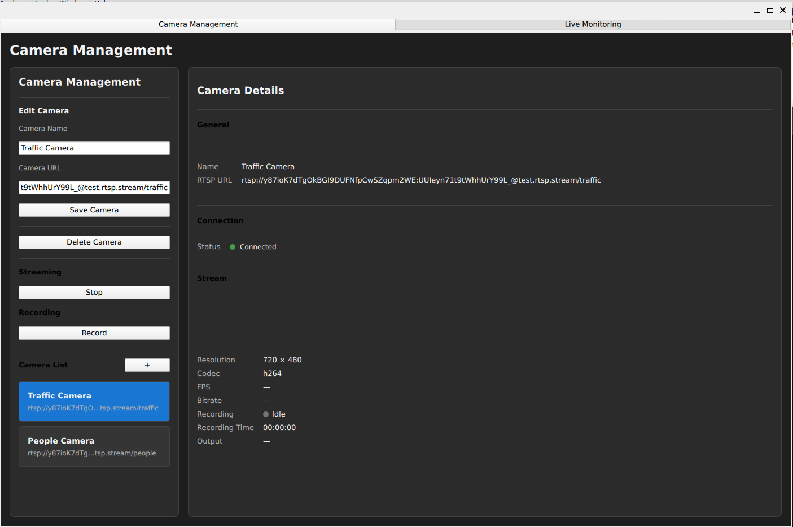
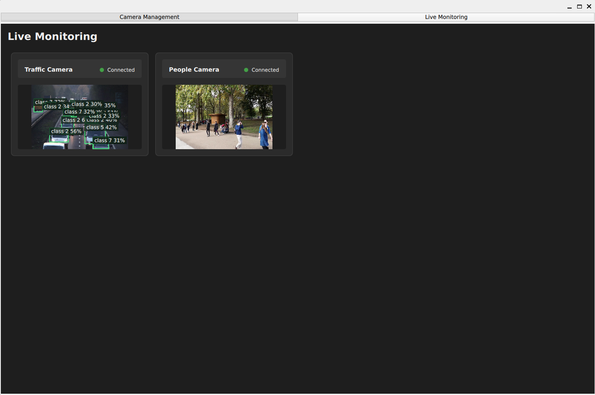
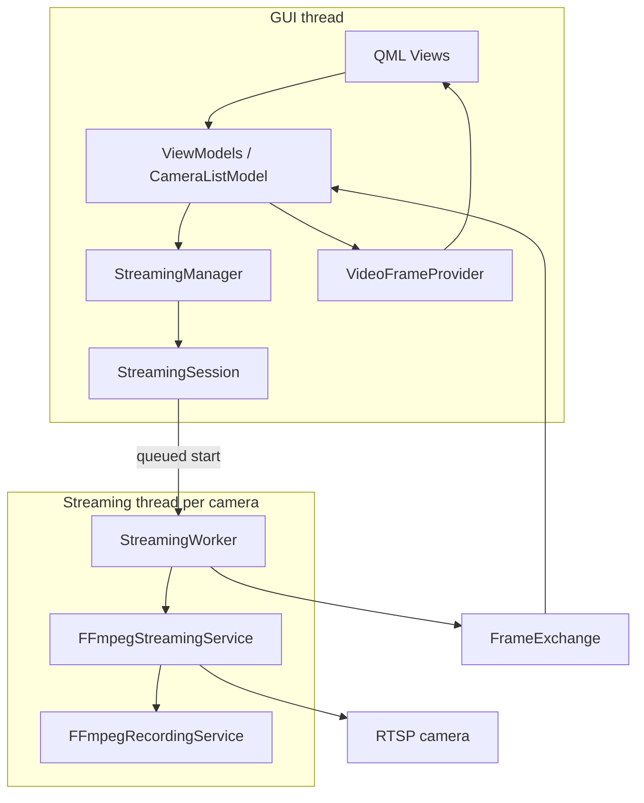

# Video Analytics Platform (VAP)

A C++20/Qt desktop application for multi-camera RTSP monitoring and MP4 recording, with asynchronous YOLOX object detection and live QML overlays. VAP demonstrates MVVM, SQLite persistence, per-camera streaming sessions, explicit resource ownership, and background inference.

> **Project status:** active development. Camera management, live monitoring, MP4 recording, and initial single-camera analytics are implemented. Analytics currently attaches to the first configured camera at startup when `VAP_ANALYTICS_MODEL` is set. Multi-camera analytics, UI activation controls, retention management, and PTZ remain roadmap items.

## Features

- Camera create, edit, delete, and selection workflows.
- SQLite-backed camera inventory.
- RTSP and local-file URL validation.
- Per-camera streaming sessions with FFmpeg decode.
- Qt/QML live monitoring grid.
- Latest-frame exchange between streaming and presentation code.
- Cooperative cancellation and interruptible reconnect delay.
- Stream connection state and basic stream statistics.
- Keyframe-aware MP4 packet-remux recording.
- Recording state, elapsed duration, and output-file presentation in QML.
- Thread-safe recording commands consumed by the streaming loop.
- YOLOX object detection through ONNX Runtime.
- Background inference with one pending frame and one latest result.
- Live detection overlays with aspect-ratio-aware coordinate mapping.
- Stream-run and analytics-generation validation to reject obsolete work.
- Expiration of stale detection overlays.
- Automated tests for camera validation, SQLite repositories, detection postprocessing, asynchronous analytics, and session removal.

## Design goals

- Modern C++20 with explicit RAII ownership.
- Qt 6/QML presentation using MVVM boundaries.
- Clear separation of camera use cases, persistence, stream orchestration, and FFmpeg infrastructure.
- Per-camera stream lifecycle with cooperative cancellation and reconnect policy.
- Latest-frame delivery suitable for live monitoring.
- Interfaces where replacement and testing are valuable.
- A foundation that can grow toward multi-camera analytics, retention management, PTZ, and GPU-oriented rendering.

## Screenshots

<!-- Add screenshots when stable UI captures are available. -->

| Camera management | Live monitoring |
| --- | --- |
|  |  |

## Technology stack

| Area | Technology |
| --- | --- |
| Core | C++20, RAII, Qt signals/slots |
| UI | Qt 6, Qt Quick, QML, Qt Quick Controls |
| Multimedia | FFmpeg: `libavformat`, `libavcodec`, `libavutil`, `libswscale` |
| Storage | SQLite through Qt SQL |
| Testing | GoogleTest via CMake `FetchContent` |
| Build | CMake 3.16+, pkg-config |
| Analytics | ONNX Runtime, YOLOX-Nano, OpenCV, C++20 `std::jthread` |

## Architecture



See [Architecture Guide](docs/architecture-guide.md) for subsystem details.
For throughput and scale considerations, see the [Performance Guide](docs/performance-guide.md).
For recording ownership and lifecycle, see the [Recording Architecture Guide](docs/recording.md).

## Current runtime ownership

| Owner | Owned objects |
| --- | --- |
| `ApplicationBootstrap` | Database, repositories, application services, streaming manager, and top-level view models |
| `StreamingManager` | One `StreamingSession` per camera |
| `StreamingSession` | Thread controller, frame exchange, statistics, and per-run cancellation source |
| `StreamingWorker` | FFmpeg streaming service through QObject parent ownership |
| `FFmpegStreamingService` | Frame converter and recording service |
| `LiveMonitoringViewModel` | Camera view models; optional analytics session as a QObject child |
| `AnalyticsSession` | Private implementation with worker thread and mailboxes; sampling timer as a QObject child |
| Analytics worker | Detector instance, created and destroyed on the analytics thread |
| `QQmlApplicationEngine` | Video image provider |

The streaming thread's `finished` signal schedules worker deletion. Destroying the worker also destroys its child streaming service.

Camera view models are owned by C++ and exposed to QML with explicit C++ ownership. They observe their streaming sessions through `QPointer`.


## Repository layout

```text
apps/desktop-client/     Qt/QML application, bootstrap, ViewModels, models, provider
modules/camera/          Camera domain, validation, repositories, application service
modules/common/          Shared types and connection state
modules/database/        SQLite connection and schema setup
modules/streaming/       Sessions, worker, reconnect, FFmpeg, frame exchange, recording
modules/video/           Video-domain interfaces and value types
tests/                   GoogleTest test targets
docs/                    Architecture and contributor documentation
apps/analytics-demo/       Single-image detection executable
apps/analytics-live-demo/  Live-stream console detection executable
modules/analytics/        Detection interface, ONNX YOLOX implementation, postprocessing
modules/analytics-qt/     Asynchronous analytics session and frame/result mailboxes
```

## Prerequisites

- CMake 3.16 or newer
- A C++20-capable compiler
- Qt 6 development packages: `Core`, `Gui`, `Quick`, `QuickControls2`, `Sql`
- FFmpeg development packages: `libavformat`, `libavcodec`, `libavutil`, `libswscale`
- pkg-config
- Network access during first configuration to fetch GoogleTest, unless it is already available through CMake's download cache

On Debian/Ubuntu-like systems, package names are commonly similar to:

```bash
sudo apt install cmake g++ pkg-config qt6-base-dev qt6-declarative-dev \
  libavformat-dev libavcodec-dev libavutil-dev libswscale-dev
```

## Build

```bash
cmake -S . -B build -DCMAKE_BUILD_TYPE=Debug
cmake --build build -j
```

## Run

```bash
./build/apps/desktop-client/desktop_client
```

The application creates/opens `video_analytics.db` in the process working directory.

## Build and run with analytics

Analytics is optional and disabled by default.

Additional dependencies:

- OpenCV 4 development packages providing `core`, `imgproc`, and `imgcodecs`.
- An extracted ONNX Runtime package containing its C++ headers and shared library.
- A compatible raw-output YOLOX-Nano ONNX model with input shape `[1, 3, 416, 416]` and output shape `[1, 3549, 85]`.

Model weights and ONNX Runtime binaries are external dependencies.

Configure and build, replacing the runtime path with your installation:

```bash
cmake -S . -B build-analytics \
  -DCMAKE_BUILD_TYPE=Debug \
  -DVAP_BUILD_ANALYTICS=ON \
  -DONNXRUNTIME_ROOT="/absolute/path/to/onnxruntime"

cmake --build build-analytics --parallel 2
```

Run with a model:

```bash
VAP_ANALYTICS_MODEL="/absolute/path/to/yolox_nano.onnx" \
  ./build-analytics/apps/desktop-client/desktop_client
```

Analytics attaches to the first camera returned by the stored camera inventory at startup. Check the `Analytics attached to camera` log, start that camera, and open Live Monitoring.

If no cameras are configured, add one and restart the application. Adding a camera after startup does not automatically attach analytics.

Run the analytics and session-removal tests:

```bash
ctest --test-dir build-analytics \
  -R '^(YoloXPostprocessingTest|AnalyticsSessionTest|SessionRemovalTest)\.' \
  --output-on-failure
```

See [Live Analytics](docs/live-analytics.md) for the processing flow, ownership, and limitations.

## Test

```bash
ctest --test-dir build --output-on-failure
```

## Current capabilities

Implemented today:

- camera inventory management;
- SQLite camera persistence;
- RTSP/open-file stream validation;
- FFmpeg video decode and RGB image conversion;
- live Qt Quick monitoring UI;
- connection state, basic statistics, retry policy, and cooperative cancellation.
- start/stop MP4 recording from live video packets;
- keyframe-aware recording initialization and recording state/duration UI updates.
- standalone image and live-stream detection demos;
- background YOLOX inference for one configured camera;
- QML detection overlays with run validation and age-based expiration.

## Roadmap

- Recording retention, disk-space policy, segmentation, and export workflows.
- Analytics UI controls, complete class-name presentation, and multi-camera scheduling.
- Object tracking, region-based rules, and detection events.- Hardware-accelerated decode and GPU-native presentation.
- Camera groups, saved layouts, fullscreen monitoring, and multi-page navigation.
- PTZ control and camera capability discovery.
- Authentication, credential protection, auditability, and operational telemetry.
- Expanded concurrency, streaming, and UI test coverage.

## Release history

| Release | Milestone |
| --- | --- |
| `v1.10.0` | Initial live analytics overlays, asynchronous processing, and lifecycle fixes |
| `v1.9.0` | Standalone ONNX YOLOX detector and image demo |
| `v1.8.2` | Thread-safe recording command handling |
| `v1.8.1` | Deferred, keyframe-aware MP4 recording initialization |
| `v1.8.0` | MP4 recording controls, state, duration, and output information |
| `v1.7.1` | Streaming architecture refinements and frame-exchange encapsulation |
| `v1.7.0` | Latest-frame rendering architecture |
| `v1.6.0` | Live stream statistics |
| `v1.5.1` | UI polish and camera details inspector |
| `v1.5.0` | State-aware camera connection control and monitoring UI improvements |
| `v1.4.0` | Live monitoring UI |
| `v1.3.0` | Streaming manager integration and session architecture |
| `v1.2.0` | Automatic stream reconnection |
| `v1.1.0` | Threaded streaming and graceful shutdown |
| `v1.0.0` | End-to-end RTSP rendering pipeline |
| `v0.2.0`–`v0.10.0` | Camera CRUD, validation, SQLite persistence, RTSP, decode, and conversion milestones |

## License

No license file is currently included in this repository. Add an explicit open-source license before distributing or accepting external contributions.

## Acknowledgements

- [Qt](https://www.qt.io/) for the application and QML framework.
- [FFmpeg](https://ffmpeg.org/) for multimedia demuxing and decoding.
- [SQLite](https://www.sqlite.org/) for embedded persistence.
- [GoogleTest](https://github.com/google/googletest) for unit testing.

## Changelog

See [CHANGELOG.md](CHANGELOG.md) for release-by-release history.
