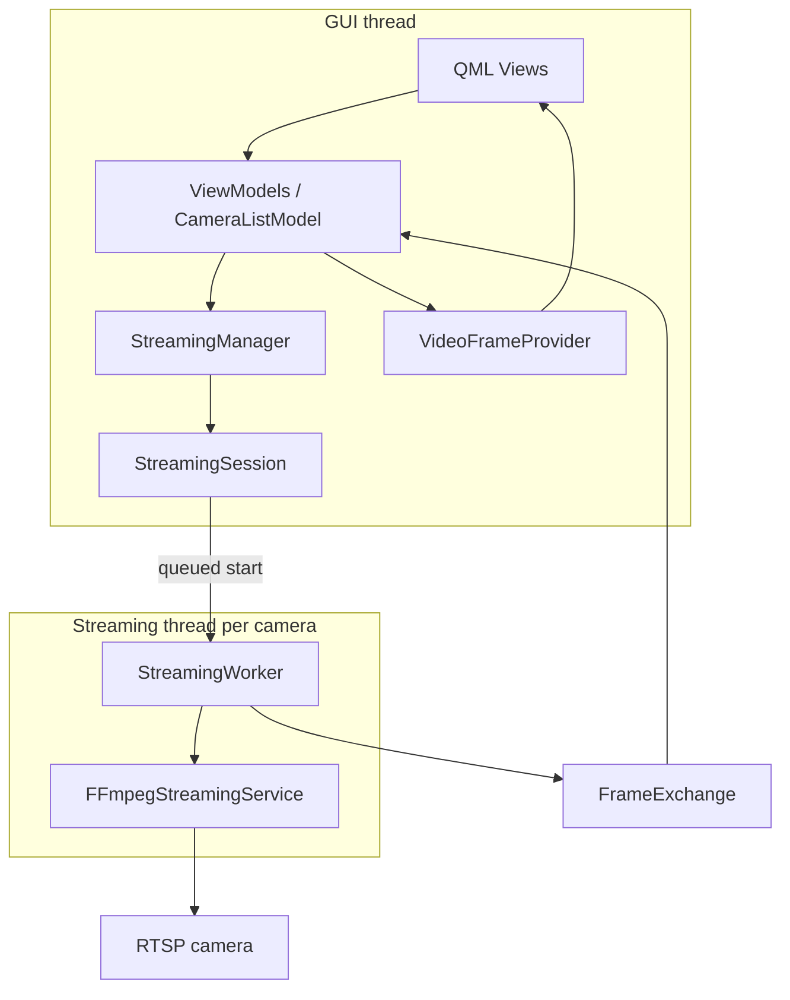

# Video Analytics Platform (VAP)

A production-oriented Video Management System (VMS) foundation built with modern C++20, Qt 6, and FFmpeg. VAP demonstrates per-camera session management, MVVM, explicit dependency composition, thread-aware RTSP streaming, and real-time video monitoring.

> **Project status:** active development. The implemented scope is live monitoring and camera management; recording, analytics, PTZ, and multi-layout operations are roadmap items.

## Features

- Camera create, edit, delete, and selection workflows.
- SQLite-backed camera inventory.
- RTSP and local-file URL validation.
- Per-camera streaming sessions with FFmpeg decode.
- Qt/QML live monitoring grid.
- Latest-frame exchange between streaming and presentation code.
- Cooperative cancellation and interruptible reconnect delay.
- Stream connection state and basic stream statistics.
- Unit tests for camera validation and SQLite repository behavior.

## Design goals

- Modern C++20 with explicit RAII ownership.
- Qt 6/QML presentation using MVVM boundaries.
- Clear separation of camera use cases, persistence, stream orchestration, and FFmpeg infrastructure.
- Per-camera stream lifecycle with cooperative cancellation and reconnect policy.
- Latest-frame delivery suitable for live monitoring.
- Interfaces where replacement and testing are valuable.
- A foundation that can grow toward recording, analytics, PTZ, and GPU-oriented rendering.

## Screenshots

<!-- Add screenshots when stable UI captures are available. -->

| Camera management | Live monitoring |
| --- | --- |
| `docs/images/camera-management.png` | `docs/images/live-monitoring.png` |

## Technology stack

| Area | Technology |
| --- | --- |
| Core | C++20, RAII, Qt signals/slots |
| UI | Qt 6, Qt Quick, QML, Qt Quick Controls |
| Multimedia | FFmpeg: `libavformat`, `libavcodec`, `libavutil`, `libswscale` |
| Storage | SQLite through Qt SQL |
| Testing | GoogleTest via CMake `FetchContent` |
| Build | CMake 3.16+, pkg-config |

## Architecture



See [Architecture Guide](docs/architecture-guide.md) for subsystem details.
For throughput and scale considerations, see the [Performance Guide](docs/performance-guide.md).

## Current runtime ownership

```text
ApplicationBootstrap
├── Database
├── SQLiteCameraRepository
├── CameraValidator
├── CameraApplicationService
├── CameraManagementViewModel
├── StreamingManager
│   └── StreamingSession (one per camera)
│       ├── QThread
│       ├── StreamingWorker
│       ├── FFmpegStreamingService
│       ├── FrameExchange
│       └── StreamStatistics
└── LiveMonitoringViewModel
    └── CameraStreamViewModel (on demand per camera)
```

## Repository layout

```text
apps/desktop-client/     Qt/QML application, bootstrap, ViewModels, models, provider
modules/camera/          Camera domain, validation, repositories, application service
modules/common/          Shared types and connection state
modules/database/        SQLite connection and schema setup
modules/streaming/       Sessions, worker, reconnect, FFmpeg, frame exchange
modules/video/           Video-domain interfaces and value types
tests/                   GoogleTest test targets
docs/                    Architecture and contributor documentation
```

## Prerequisites

- CMake 3.16 or newer
- A C++20-capable compiler
- Qt 6 development packages: `Core`, `Gui`, `Quick`, `QuickControls2`, `Sql`
- FFmpeg development packages: `libavformat`, `libavcodec`, `libavutil`, `libswscale`
- pkg-config
- Network access during first configuration to fetch GoogleTest, unless it is already available through CMake's download cache

On Debian/Ubuntu-like systems, package names are commonly similar to:

```bash
sudo apt install cmake g++ pkg-config qt6-base-dev qt6-declarative-dev \
  libavformat-dev libavcodec-dev libavutil-dev libswscale-dev
```

## Build

```bash
cmake -S . -B build -DCMAKE_BUILD_TYPE=Debug
cmake --build build -j
```

## Run

```bash
./build/apps/desktop-client/desktop_client
```

The application creates/opens `video_analytics.db` in the process working directory.

## Test

```bash
ctest --test-dir build --output-on-failure
```

## Current capabilities

Implemented today:

- camera inventory management;
- SQLite camera persistence;
- RTSP/open-file stream validation;
- FFmpeg video decode and RGB image conversion;
- live Qt Quick monitoring UI;
- connection state, basic statistics, retry policy, and cooperative cancellation.

## Roadmap

- Recording and retention management.
- Analytics/inference pipeline and overlays.
- Hardware-accelerated decode and GPU-native presentation.
- Camera groups, saved layouts, fullscreen monitoring, and multi-page navigation.
- PTZ control and camera capability discovery.
- Authentication, credential protection, auditability, and operational telemetry.
- Expanded concurrency, streaming, and UI test coverage.

## Release history

| Release | Milestone |
| --- | --- |
| `v1.7.1` | Streaming architecture refinements and frame-exchange encapsulation |
| `v1.7.0` | Latest-frame rendering architecture |
| `v1.6.0` | Live stream statistics |
| `v1.5.1` | UI polish and camera details inspector |
| `v1.5.0` | State-aware camera connection control and monitoring UI improvements |
| `v1.4.0` | Live monitoring UI |
| `v1.3.0` | Streaming manager integration and session architecture |
| `v1.2.0` | Automatic stream reconnection |
| `v1.1.0` | Threaded streaming and graceful shutdown |
| `v1.0.0` | End-to-end RTSP rendering pipeline |
| `v0.2.0`–`v0.10.0` | Camera CRUD, validation, SQLite persistence, RTSP, decode, and conversion milestones |

## License

No license file is currently included in this repository. Add an explicit open-source license before distributing or accepting external contributions.

## Acknowledgements

- [Qt](https://www.qt.io/) for the application and QML framework.
- [FFmpeg](https://ffmpeg.org/) for multimedia demuxing and decoding.
- [SQLite](https://www.sqlite.org/) for embedded persistence.
- [GoogleTest](https://github.com/google/googletest) for unit testing.
