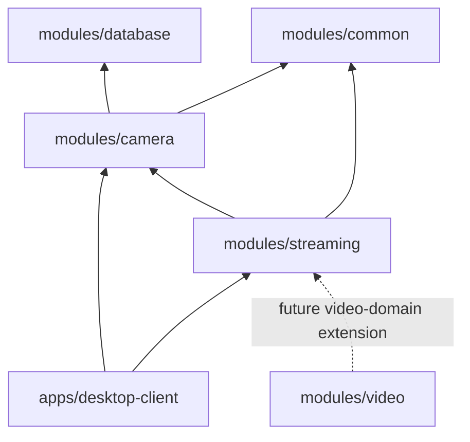
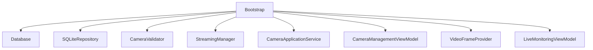
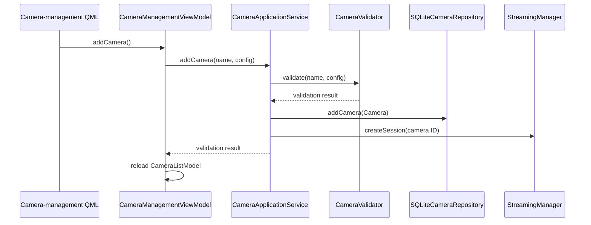
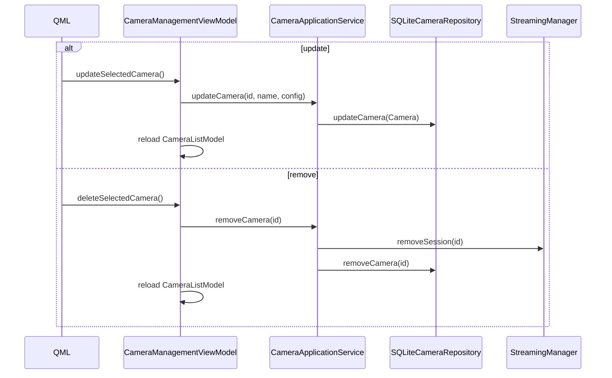

# Architecture Guide

## Architectural style

The application uses a layered, dependency-directed design:

```text
QML Views
  → Presentation layer: ViewModels and Qt models
  → Application layer: camera use cases and stream coordination
  → Infrastructure layer: SQLite, FFmpeg, Qt image provider
```

Domain values (`Camera`, `CameraConfig`, validation results, connection state, stream statistics) move between layers without giving QML direct access to database or FFmpeg APIs.

## Module dependency map



The desktop application is the executable composition layer. `camera`, `streaming`, and `database` hold the implementation concerns; `common` carries shared Qt-facing types. `video` contains video-domain headers that are not yet part of the active live-view path.

## Composition root

`ApplicationBootstrap` is the composition root. It creates the database, concrete repository, validator, application service, streaming manager, Qt image provider, and top-level ViewModels. It then places the ViewModels in the QML context.



The bootstrap owns long-lived objects through `std::unique_ptr`. Classes that receive collaborators use non-owning pointers or references; the bootstrap's lifetime ordering keeps dependencies alive while consumers exist.

## Runtime ownership

```text
StreamingManager
└── StreamingSession (one per camera ID)
    ├── QThread
    ├── StreamingWorker
    ├── FFmpegStreamingService : IStreamingService
    │   └── FFmpegFrameConverter : IFrameConverter
    │   └── FFmpegRecordingService
    ├── FrameExchange
    ├── connection state
    └── stream statistics
```

This graph answers two separate questions: `StreamingManager` owns session lifetime, while each session owns the resources required for one active-or-idle camera stream.

## Camera subsystem

### Domain

- `Camera`: ID, human-readable name, and configuration.
- `CameraConfig`: currently holds the source URL.
- `CameraValidator`: validates required fields and supported URL schemes.

### Repository boundary

`ICameraRepository` defines CRUD operations. `SQLiteCameraRepository` maps `Camera` values to rows in the `cameras` table. `Database` owns the Qt SQL connection and ensures the schema exists.

### Application service

`CameraApplicationService` coordinates the add, update, and remove use cases:

- validates an input configuration;
- generates a UUID for new cameras;
- persists camera values;
- creates/removes the matching runtime stream session.

The service is deliberately not a QML object. Its API is consumed by `CameraManagementViewModel`.

## Presentation subsystem

### CameraManagementViewModel

This ViewModel owns editable form fields, selection state, validation feedback, and a `CameraListModel`. It exposes `Q_PROPERTY` values and `Q_INVOKABLE` commands for QML.

### CameraListModel

`CameraListModel` adapts `QList<Camera>` to QML `ListView` and `GridView` delegates through `id`, `name`, and `url` roles.

The model exists instead of exposing a raw `QList<Camera>` directly because Qt Quick views consume `QAbstractItemModel` efficiently through roles and delegate lifecycle. This keeps the camera domain type independent of QML delegate mechanics.

### LiveMonitoringViewModel and CameraStreamViewModel

`LiveMonitoringViewModel` obtains a stream ViewModel for a camera ID. `CameraStreamViewModel` maps `StreamingSession` state into QML-friendly state, frame revision, video availability, and stream statistics.

### VideoFrameProvider

The provider bridges the presentation model to Qt Quick's `image://video/...` URL mechanism. It stores the most recent `QImage` per camera ID and returns it on QML image requests.

## Streaming subsystem

### StreamingManager

The manager owns `std::map<QString, std::unique_ptr<StreamingSession>>`. It is the camera-ID registry and exposes create, remove, start, stop, and lookup operations.

### StreamingSession

A session is the per-camera runtime aggregate. It owns:

- one `QThread`;
- one `StreamingWorker`;
- one `IStreamingService` implementation;
- one `FrameExchange`;
- current presentation-facing state and statistics.

The session exposes a GUI-thread-facing API; it queues `start()` to its worker thread and forwards worker state to the GUI.

### StreamingWorker

The worker runs blocking streaming attempts, applies reconnect policy, waits between retries, and coordinates cancellation. It does not use FFmpeg directly.

### FFmpegStreamingService

This infrastructure implementation owns FFmpeg contexts and performs one streaming attempt: open source, inspect streams, configure a decoder, read packets, decode frames, convert pixels, coordinate packet-remux recording, and emit results.

### FFmpegRecordingService

`FFmpegRecordingService` is owned by the streaming service and used on the camera streaming thread. It remuxes encoded video packets into MP4 output. A request enters `Starting` and waits for a video keyframe before output initialization, so a newly created recording begins at a decodable video boundary.

Recording requests may originate on the GUI thread, but `IStreamingService::enqueueStartRecording()` and `enqueueStopRecording()` only write mutex-protected pending-command state. `FFmpegStreamingService::processPendingCommands()` consumes those commands from its active streaming loop and is the sole owner of recorder state and output FFmpeg resources.

### FrameExchange

`FrameExchange` is a mutex-protected latest-frame store. The worker publishes a new `FrameSnapshot`; GUI-side code reads a coherent snapshot. A snapshot contains the image, a monotonic revision, decode timestamp, and validity flag.

## Dependency injection

Dependencies are assembled explicitly in the bootstrap rather than hidden behind global singletons.

| Consumer | Injected collaborator |
| --- | --- |
| `SQLiteCameraRepository` | `Database&` |
| `CameraApplicationService` | repository, validator, streaming manager |
| `CameraManagementViewModel` | camera application service, streaming manager |
| `LiveMonitoringViewModel` | streaming manager, image provider |
| `StreamingWorker` | streaming service, frame exchange |

Interfaces are used where replacement is useful: repositories, validators, and streaming services have abstract contracts.

## Lifecycle summary

1. Bootstrap opens the database and creates a session for every persisted camera.
2. QML invokes ViewModel commands on the GUI thread.
3. A session starts video work on its streaming thread only when requested.
4. Recording commands are queued safely from the session and consumed by the active streaming loop.
5. On removal or application shutdown, the manager destroys sessions; a session requests cancellation, finalizes active recording, and waits for its worker thread to end.

## Camera CRUD flows

### Add camera



### Update and remove camera



## Current scope and future work

The active implementation includes MP4 packet-remux recording and initial single-camera analytics with live overlays. See [Live Analytics](live-analytics.md) for its threading, buffering, and limitations.

Retention policy, recording segmentation, audio recording, export workflows, multi-camera analytics scheduling, PTZ, camera groups, authentication, and hardware-specific decoder selection remain future work.

Future high-density presentation can introduce a visibility-aware presentation scheduler and GPU-oriented renderer while retaining the current camera, session, and use-case boundaries. See the [Performance Guide](performance-guide.md).
