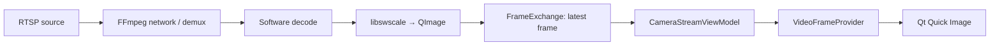
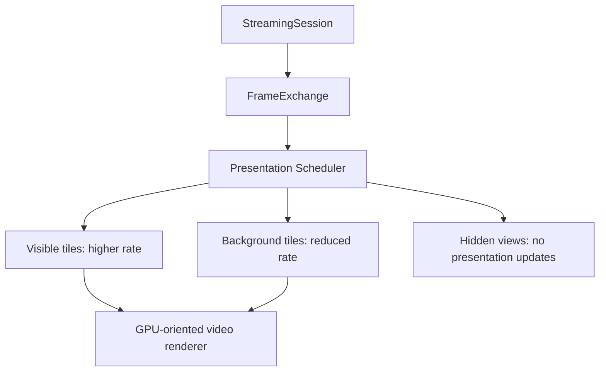

# Performance Guide

## Scope

This guide documents the performance model of the current live-view architecture and the extension points intended for larger deployments. It distinguishes current behavior from future work.

## Current frame path



The design avoids retaining a growing history of decoded frames in the frame store. `FrameExchange` keeps the current snapshot, replacing the previous one when a new frame is published.

## Why a latest-frame exchange

Live monitoring prioritizes freshness. If a UI consumer cannot present every decoded image, displaying the latest available image is more useful than showing an ever-older queue.

```text
Decode:      1 → 2 → 3 → 4 → 5
Exchange:    5
Presentation snapshot: newest available frame
```

This does not define the contract for recording or analytics. Those subsystems need their own explicit buffering, timestamp, and loss policies.

## Current cost centers

The primary areas to profile as camera count grows are:

- FFmpeg network I/O and decoder CPU use.
- pixel conversion from decoder format to RGB `QImage`.
- `QImage` allocation/copy behavior.
- Qt Quick image-provider requests and texture upload.
- QML tile count, image size, and update cadence.
- one worker thread per active stream.

Useful metrics include decode FPS, presentation FPS, frame age, CPU, RSS, GPU memory, reconnect count, and time spent in conversion/render upload.

## Future presentation scheduler

A future high-density monitoring mode can introduce a presentation scheduler without changing the fundamental session abstraction.



The scheduler can use tile visibility, selected/fullscreen status, operator layout, and frame age to choose a presentation rate and target resolution.

## GPU and hardware-decode roadmap

The current CPU `QImage` transport is intentionally straightforward for a Qt desktop foundation. A future multimedia scale-up can add:

- hardware decode selection where supported;
- GPU-native frame surfaces;
- texture-based Qt Quick rendering;
- source/resolution adaptation by tile size;
- decode/presentation resource budgeting.

These changes should remain infrastructure/presentation concerns. Camera domain, application service, and session lifecycle APIs should not need to know the graphics implementation.

## Reconnection performance

Reconnect waits use `QWaitCondition` rather than a blocking sleep. This lets cancellation wake the worker immediately and avoids keeping shutdown latency tied to the retry interval.

## Benchmarking guidance

Before claiming a supported camera count, measure representative cameras and layouts:

1. single camera at target resolution/FPS;
2. representative grid with mixed streams;
3. reconnect storms and unreachable endpoints;
4. hidden/visible page transitions;
5. sustained operation with memory and frame-age monitoring.

