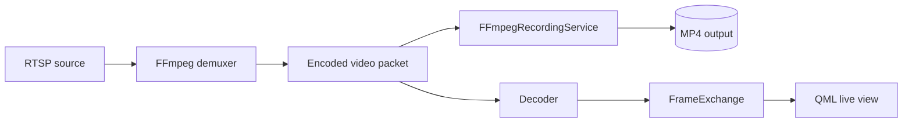
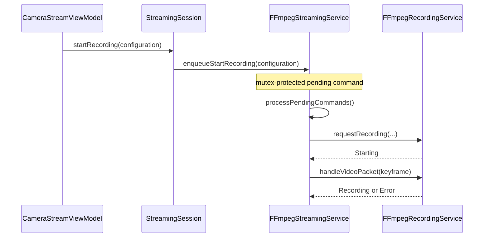

# Recording Architecture

## Scope

VAP supports manual start/stop recording of the selected video stream to an MP4 file. Recording is packet remuxing: it writes encoded packets from the live FFmpeg input path rather than re-encoding decoded `QImage` frames.

## Data path



## Ownership and thread affinity

- `StreamingSession` owns the per-camera streaming thread and streaming service.
- `FFmpegStreamingService` owns `FFmpegRecordingService`.
- `FFmpegRecordingService` runs only in the camera streaming thread.
- The recorder owns its output `AVFormatContext`, output `AVStream`, and recording timer.
- The streaming service owns the input contexts, packet, and decoder.

## Command flow

The GUI-side ViewModel asks `StreamingSession` to start or stop recording. The session calls a thread-safe command-ingress method on `IStreamingService`. That method stores a pending command under `m_commandMutex`; it does not access FFmpeg output resources or recorder state.

The active FFmpeg stream loop calls `processPendingCommands()` and performs the actual recorder transition in the streaming thread.



## Keyframe-aware initialization

A recording request enters `Starting`. The recorder ignores inter-frames until it receives a packet marked with `AV_PKT_FLAG_KEY`. It then creates the MP4 output context, copies codec parameters, writes the MP4 header, and remuxes that keyframe followed by subsequent packets.

This avoids beginning a new recording at a packet that depends on prior frames unavailable in the output file.

## State and duration presentation

`RecordingState` values are propagated through:

```text
FFmpegStreamingService
  → StreamingWorker
  → StreamingSession
  → CameraStreamViewModel
  → QML
```

The ViewModel exposes recording activity, state text, action availability, elapsed duration, and the selected output filename. `QElapsedTimer` supplies elapsed wall-clock duration while recording is active.

## Stream cleanup

When the stream exits, `FFmpegStreamingService::cleanup()` stops an active or pending recording before it releases input FFmpeg resources. The recorder attempts to write its trailer for an active MP4 recording, closes output I/O, and releases the output context.

## Current limitations and roadmap

Current scope:

- one selected video stream;
- MP4 output;
- manual start/stop;
- keyframe-aware start;
- elapsed-duration presentation.

Future work:

- timestamp normalization and discontinuity policy;
- audio-stream policy;
- segmented recording and retention;
- storage quotas and disk-space monitoring;
- export workflows and metadata index;
- recording error presentation and integration tests.

