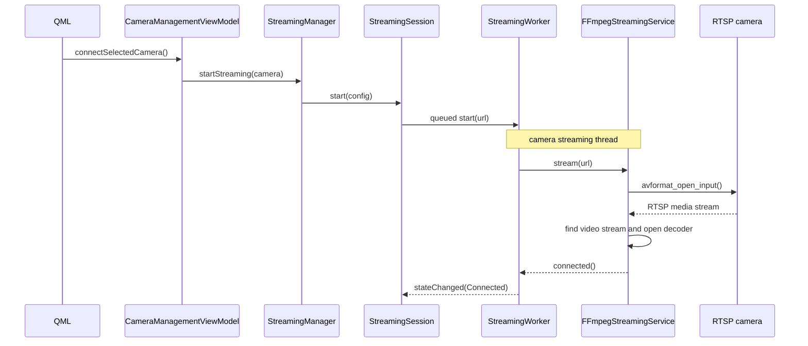
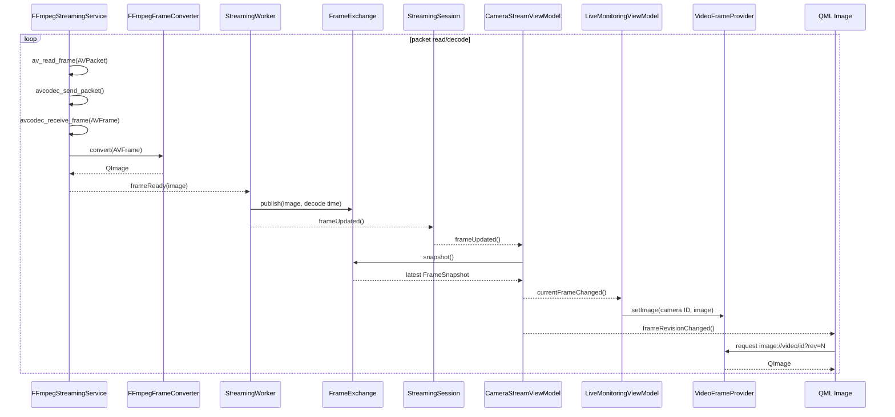
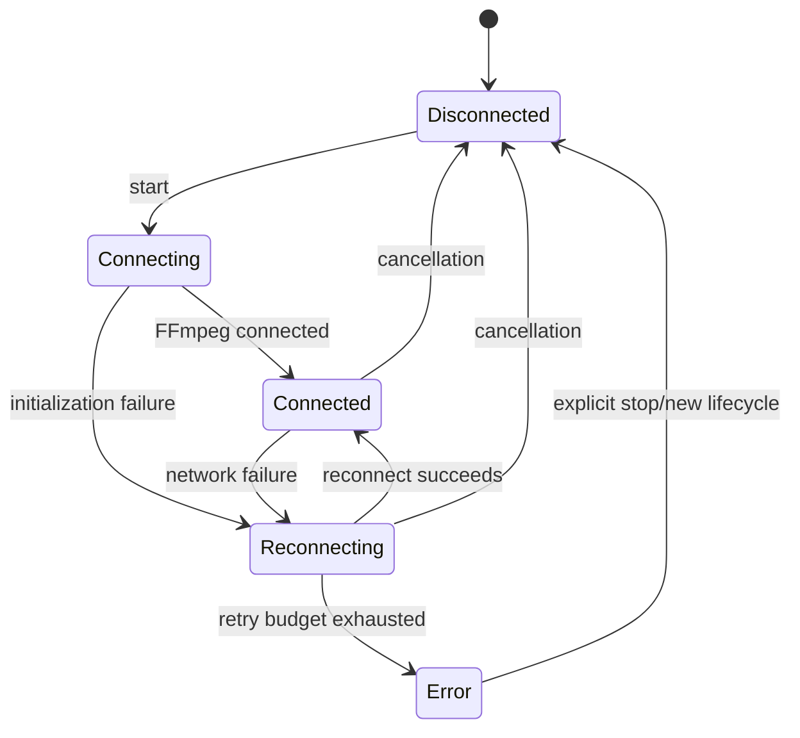

# Streaming Pipeline

## Purpose

The streaming pipeline turns a configured RTSP source into a current image available to the Qt Quick UI without running FFmpeg work in the GUI thread.

## Connect sequence



## Decode and frame delivery



## FFmpeg resources

`FFmpegStreamingService` owns the resources used by a streaming attempt:

| Resource | Role |
| --- | --- |
| `AVFormatContext` | RTSP input, stream metadata, packet read |
| `AVCodecContext` | video decoder state |
| `AVPacket` | reusable compressed-packet container |
| `AVFrame` | reusable decoded-frame container |
| `SwsContext` | pixel-format conversion, owned by `FFmpegFrameConverter` |

The service initializes these in stream setup and releases them through its cleanup methods before an attempt ends.

## Latest-frame contract

The live-view contract is intentionally not “deliver every decoded frame.” It is “make the newest decoded frame observable.”

```text
producer: publish frame 101 → publish frame 102 → publish frame 103
consumer: snapshot() receives the latest available snapshot
```

`FrameSnapshot.revision` identifies a new published frame. `decodeTime` enables future frame-age/latency monitoring. `valid` distinguishes an empty exchange from a real image.

## Connection states



## Statistics

`FFmpegStreamingService` updates codec, resolution, FPS, bitrate, received packet count, and decoded frame count. It emits statistics at approximately one-second intervals, and `StreamingSession` forwards them to `CameraStreamViewModel` for QML display.

## Recording

Recording is not implemented. A future recording subsystem should consume encoded packets or a dedicated media pipeline, not frames retrieved through the GUI-facing `FrameExchange`.

