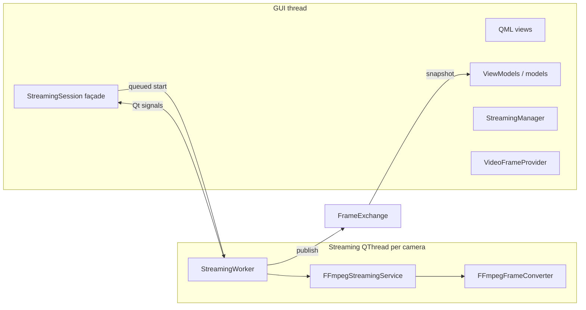
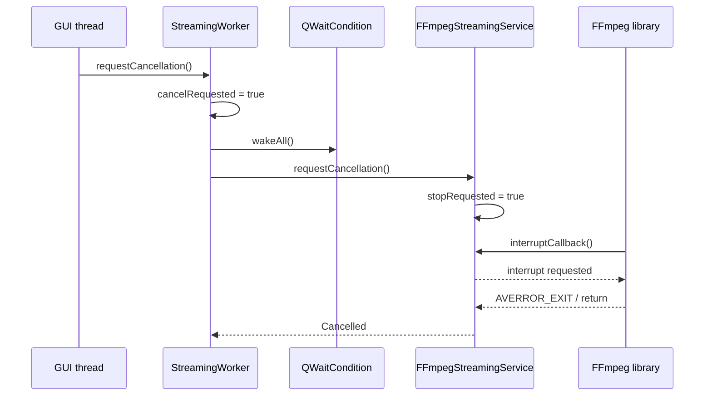

# Threading and Lifetime Guide

## Thread model

The application separates interactive Qt Quick work from blocking video work.



## QObject affinity

`StreamingSession` is created on the GUI thread. During construction it creates `StreamingWorker` and `FFmpegStreamingService`, then moves both objects to its dedicated `QThread` before starting the thread.

| Object | Primary affinity / use |
| --- | --- |
| QML, ViewModels, `StreamingManager`, `StreamingSession` | GUI thread |
| `StreamingWorker` | camera streaming thread |
| `FFmpegStreamingService` | camera streaming thread |
| `FrameExchange` | shared, synchronized value object |
| `VideoFrameProvider` | Qt Quick image-provider path |

The session does not execute FFmpeg operations directly. It invokes worker `start(QString)` with `Qt::QueuedConnection`, which places the operation in the worker thread's event queue.

## Frame synchronization

`FrameExchange` uses `QMutex` to protect a `FrameSnapshot`.

```text
StreamingWorker                         GUI-side CameraStreamViewModel
----------------                         ------------------------------
publish(QImage)                          currentFrame()
  lock mutex                               lock mutex
  replace snapshot.image                   copy FrameSnapshot
  increment revision                       unlock mutex
  update timestamp
  unlock mutex
```

The lock protects snapshot metadata and the `QImage` handle. `QImage` is implicitly shared, so snapshots normally share image storage without copying all pixels.

## Cancellation and waiting

`StreamingWorker` owns:

- atomic `m_cancelRequested` for worker-loop cancellation;
- `QMutex` and `QWaitCondition` for interruptible reconnect waits.

`FFmpegStreamingService` owns atomic `m_stopRequested`, which is checked by its FFmpeg interrupt callback.



The wait condition matters because retry delay must be interruptible. A normal sleep would delay stop/destruction until the sleep expires.

## Object lifetime

```text
ApplicationBootstrap
  owns StreamingManager
    owns StreamingSession for each camera
      owns QThread
      owns StreamingWorker
      owns IStreamingService implementation
      owns FrameExchange by value
```

The `StreamingSession` destructor requests cancellation, asks the thread to quit, and waits for it to finish. This gives the session a clear lifecycle boundary: it should not disappear while its streaming work is intended to continue.

`CameraApplicationService::removeCamera()` removes the runtime session through `StreamingManager` and then removes the persisted camera record.

## Signal communication

Signals carry state and notifications:

- service → worker: connected, frame-ready, statistics;
- worker → session: frame-updated, connection state, errors;
- session → stream ViewModel: state, statistics, frame-updated;
- stream ViewModel → QML: Q_PROPERTY change signals.

The actual latest image is retrieved through `FrameExchange`, not owned by the notification signal itself.

## Recording thread

No recording thread exists in the current implementation. Recording must introduce its own explicit resource ownership, queueing/loss policy, and shutdown coordination when added.

